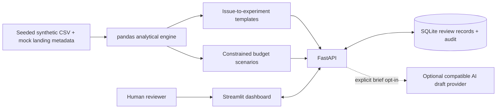

# AI Paid Media Optimization & Experimentation Agent

**An explainable decision-support system for performance marketers.** Analyze Google Ads, Meta Ads and LinkedIn Ads, investigate weak performance, design measurable experiments, and record human decisions—without connecting to or changing any ad account.

Python · FastAPI · Streamlit · pandas · SQLite · pytest · Docker


## Business problem

Performance marketers spend time reconciling channel reports, interpreting volatile metrics and turning vague suggestions into testable decisions. A lower CPA can hide poor lead quality; a falling CTR can reflect creative fatigue, a changing audience or auction pressure. More spend does not necessarily create incremental value.

This project brings evidence, uncertainty, recommendations and experiment governance into one workflow. It is a portfolio demonstration built entirely from **synthetic data**, with deterministic analytical rules and optional AI-assisted creative ideation. It does not claim to predict business outcomes.

## What you can do

- Compare CTR, CPC, CPM, CVR, CPA, ROAS, cost per lead and covered cost per MQL using ratios of totals.
- Inspect a campaign's 0–100 health score, component scores, planning targets, observed CVR interval and issue evidence.
- Detect rising CPA, falling ROAS/CTR, increasing frequency, weak CVR, spend without results and likely tracking anomalies.
- Identify likely fatigue at the **creative level**, using frequency, impression volume and response trends.
- Generate a structured experiment for **every identified issue**: hypothesis, test, primary/secondary KPI, success criteria and guardrails.
- Draft headlines, primary text, CTAs and value proposition angles from audience, product, tone and goal.
- Inspect alignment between mock ad keywords, promise, page proposition and CTA.
- Explore capped, spend-conserving, within-channel allocation scenarios with a sensitivity case.
- Record **Proposed → Approved → Testing → Completed**, or reject a recommendation; save results and review the audit trail.
- Export proposals, creative drafts and allocation scenarios.

Dashboard workspaces: Cross-Channel Overview, Google Ads, Meta, LinkedIn, Campaign Health, Creative Fatigue, Experiments, Recommendations, Creative Studio, Landing-Page Analysis and Budget Simulator.

## Quickstart

Requires **Python 3.12+**. Python 3.12 is the reference runtime. No provider key is needed.

```bash
python -m venv .venv
# macOS / Linux
source .venv/bin/activate
# Windows PowerShell: .\.venv\Scripts\Activate.ps1
pip install -r requirements.lock
pip install -e ".[dev]"
python scripts/dev.py
```

Open [the dashboard](http://localhost:8501) and [the interactive API documentation](http://localhost:8000/docs). Stop the launcher with Ctrl+C. If activation is unavailable, use `.venv/Scripts/python.exe` on Windows or `.venv/bin/python` on Linux in place of `python`.

If those ports are occupied, use `python scripts/dev.py --api-port 8010 --dashboard-port 8510`; the launcher sets the matching API URL automatically.

Alternatively, start the two services in separate terminals:

```bash
uvicorn paid_media.api:app --host 127.0.0.1 --port 8000
streamlit run streamlit_app.py --server.address 127.0.0.1
```

Committed sample data works immediately. To reproduce it:

```bash
python -m paid_media.data
pytest -q
ruff check .
```

### Docker

```bash
docker compose up --build
```

The API and dashboard bind to localhost on ports 8000 and 8501. A named `reviews` volume persists approval records. The dashboard waits for API health. Containers run as a non-root user. Stop with `docker compose down` (keeps reviews). Optional AI configuration is read from `.env` by Compose; copy `.env.example` if needed. For local Python runs, set environment variables yourself—the application does not automatically load `.env`.

Docker execution requires Docker Engine/Desktop. CI builds and starts the containers on Linux; local validation details are in [docs/VALIDATION.md](docs/VALIDATION.md).

## A five-minute demo

1. Open **Cross-Channel Overview** with the default window ending August 23, 2026. Compare channel efficiency and spend trends.
2. Open **Campaign Health** and select `G03`. Inspect the weak CVR and landing-page mismatch evidence.
3. Open **Creative Fatigue**. Review the flagged creative IDs and concurrent CTR/CPA changes.
4. Open **Recommendations**, choose a landing-page proposal and read its hypothesis, KPI and power-planning estimate.
5. Enter a reviewer and rationale, choose **Approved**, and record the decision. The ad account remains entirely outside this workflow.
6. Advance to **Testing** after manually starting your mock test. To mark **Completed**, record control/variant values, sample sizes, dates, outcome, guardrails and interpretation.
7. Open the audit history. Regenerate proposals for the same window and confirm the previous decision is preserved.
8. In **Creative Studio**, try a mock audience/product brief with different tones. Offline templates need no network access.
9. Explore **Budget Simulator**. Change the redistribution cap; total spend stays constant and recipient increases remain capped.

## Architecture



There is **no advertising platform write integration**. FastAPI mutations only create proposals, generate copy drafts or change local review records. Streamlit is an API client, so analytical and workflow behavior is shared across UI and API. SQLite transactions and version checks protect review changes from concurrent edits.

```text
paid_media/
  data.py          Seeded fixture generator and platform planning targets
  analytics.py     Metrics, comparison windows, health, issues, fatigue, page alignment
  experiments.py   Recommendations, sample-size estimates, budget scenarios
  creative.py      Offline copy templates and opt-in compatible API drafting
  store.py         SQLite state machine, optimistic locking and audit history
  api.py           FastAPI contracts and validation
  client.py        Streamlit API transport
streamlit_app.py   Dashboard
data/             CSV, landing metadata and provenance manifest
tests/            Analytical invariants, API workflow, AI mocks and dashboard tests
scripts/          Local launcher and reproducible screenshot capture
docs/             Methodology, data dictionary, API guide and screenshots
```

## Optimization framework

Recent and preceding non-overlapping windows default to 14 days. Metrics are recomputed from counts and amounts, never averaged from row-level ratios. Zero denominators return `null`/N/A. CRM missingness is preserved; cost per MQL uses **only spend from CRM-covered rows**, with coverage exposed.

Health combines efficiency (35%), conversion quality (20%), trend (20%), spend (10%) and sample confidence (15%). Every component and platform target is visible. Missing quality receives a disclosed neutral score; incomplete windows suppress trend flags. Targets are illustrative assumptions, not industry benchmarks. See [the exact formulas and thresholds](docs/METHODOLOGY.md).

Frequency is an impression-weighted proxy, not deduplicated reach. Fatigue combines several signals at creative grain; it is a hypothesis to investigate. Sparse data gets lower confidence, and even adequate volume does not establish causality.

## Experimentation methodology

Observe → diagnose → select one hypothesis → pre-register → human approval → manually run → record results → assess.

Each recommendation separates its observed evidence from its causal hypothesis. Tests specify one primary KPI and guardrails for quality, spend and secondary metrics. CTR/CVR plans include a two-proportion approximation at 80% power, 5% two-sided alpha and a 15% relative minimum detectable effect. CPA/ROAS tests require variance-aware or matched-market planning; the tool deliberately supplies no binomial significance claim for them.

Marketers must avoid overlapping changes, account for user clustering and conversion lag, and correct for multiple tests. Underpowered tests can be recorded as **Inconclusive**. Outcome entry is a human judgment, not an automated statistical win declaration. Full details: [experimentation methodology](docs/METHODOLOGY.md#experiment-design).

### Example recommendation

| Field | Example |
|---|---|
| Campaign | `G03` · Google · Revenue Analytics · Landing mismatch |
| Evidence | Weak CVR; landing proposition and CTA do not match the ad promise |
| Action | Change landing page |
| Hypothesis | Landing-page mismatch is reducing conversion rate. |
| Test | Create a landing page aligned with ad messaging and randomize eligible users 50/50. |
| Primary / secondary KPI | CVR / CPA |
| Success criteria | +15% CVR with stable traffic quality and no more than 5% CPA increase |
| Initial status | Proposed; requires human approval |


## Why AI supports human budget decisions

Advertising data is noisy and attribution is incomplete. AI cannot infer an organization's risk tolerance, cash constraints, brand priorities or true incrementality from channel metrics alone. Autonomous changes can amplify measurement errors, overspend, interrupt learning phases and optimize toward poor-quality conversions.

This project uses deterministic rules for analysis and AI only as an optional copywriting assistant. Humans own diagnosis, prioritization, experiment approval, account changes and interpretation. **Approved means recorded approval, never execution.** There is no scheduler, ad-account credential, SDK or execution endpoint for campaign changes.

Reviewer names in this local demo are self-reported. The audit trail is append-only through the application, not a tamper-proof compliance ledger. Public deployment would require authentication, authorization, an appropriate database and operational controls.

## Optional AI drafting

Offline mode is the default and completes the full analytical workflow. Set these variables on the API process only if you want to send a synthetic creative brief to your chosen compatible provider:

```text
ENABLE_AI=true
OPENAI_BASE_URL=https://api.openai.com/v1
OPENAI_MODEL=<model-supported-by-your-provider>
OPENAI_API_KEY=<your-key>
```

Then explicitly select the AI checkbox in Creative Studio. Only the mock audience, product, tone and goal are sent. Responses must match the draft schema; invalid/provider-error responses produce an actionable error and offline templates remain available. No analytical result, approval or budget instruction is delegated to the model. Provider output still needs brand, claims and policy review. External providers may incur charges.

## Data and limitations

- **2,016 synthetic daily creative rows** across 84 days, 12 campaigns, 24 creatives and three platforms. All URLs use the reserved `.example` domain.
- Seed 42 creates healthy, fatigue, mismatch and tracking-anomaly scenarios plus realistic variation. Labels are fixture provenance, never inputs to diagnosis.
- All conversions are mock demo leads; attributed revenue is illustrative pipeline value, not booked revenue or profit. Cross-platform conversion identities are not deduplicated.
- No live connectors, real customer data, imports, landing-page scraping or production accounts are included.
- Health and trend rules are transparent heuristics, not trained predictive models. Wilson intervals assume independent trials; repeated users and auction clustering violate that assumption.
- Landing alignment uses token/CTA matching and cannot assess page speed, accessibility, offer credibility or semantic nuance.
- Budget scenarios assume constant historical CPA and show a 20% worse-CPA sensitivity. They omit auction responses, diminishing returns, lead quality changes, incrementality and revenue lag.
- Recommendation sets for new windows are separate dated proposals; humans must reconcile overlapping tests. Rejected and Completed records are terminal.
- Localhost demo only: no authentication, RBAC, durable migrations, test execution service or true provider integration validation.

## Further documentation

[Methodology](docs/METHODOLOGY.md) · [Data dictionary](docs/DATA_DICTIONARY.md) · [API guide](docs/API.md) · [Validation](docs/VALIDATION.md) · [Contributing](CONTRIBUTING.md)

Framework references: [Streamlit app structure](https://docs.streamlit.io/develop/concepts/multipage-apps/overview) and [FastAPI lifespan testing](https://fastapi.tiangolo.com/advanced/testing-events/). UI smoke tests use Streamlit AppTest; API tests start and stop the application lifespan in TestClient.

MIT licensed. Built for technical and paid-media portfolio review; it contains no actual campaign results or claimed commercial impact.
